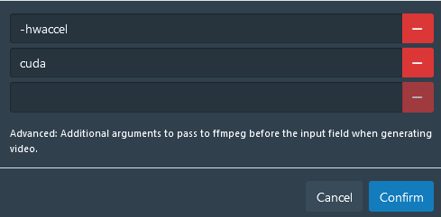
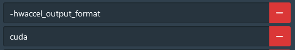
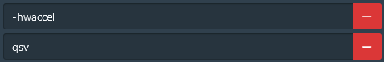

# docker-stash

Unofficial Docker image for https:/github.com/stashapp/stash

The image replaces ffmpeg with jellyfin-ffmpeg and include the required python dependencies for scrapers and plugins.

jellyfin-ffmpeg contains multiple patches and optimisations to enable full hardware transcoding and is more performant than the current implementation in stash.

For live transcoding using HW acceleration ensure that it's enabled in the System>Transcoding settings. For general transcoding (generating previews etc.) you need to include the relevant ffmpeg args for your GPU. See the below example args for an Nvidia GPU.

### Nvidia Decoding



### Nvidia Encoding



### Intel Transcoding

Intel CPUs with an iGPU can utilise full hardware transcoding (decode and encode) with the below args.



### docker-compose

You must modify the below compose file to pass through your GPU to the docker container. See this helpful guide from Jellyfin for more info. https://jellyfin.org/docs/general/administration/hardware-acceleration/

```yaml
services:
  stash:
    image: nerethos/stash-jellyfin-ffmpeg
    container_name: stash
    restart: unless-stopped
    ## the container's port must be the same with the STASH_PORT in the environment section
    ports:
      - "9999:9999"
    ## If you intend to use stash's DLNA functionality uncomment the below network mode and comment out the above ports section
    # network_mode: host
    logging:
      driver: "json-file"
      options:
        max-file: "10"
        max-size: "2m"
    environment:
      - PUID=1000
      - PGUID=1000
      - STASH_STASH=/data/
      - STASH_GENERATED=/generated/
      - STASH_METADATA=/metadata/
      - STASH_CACHE=/cache/
      ## Adjust below to change default port (9999)
      - STASH_PORT=9999
    volumes:
      - /etc/localtime:/etc/localtime:ro
      ## Adjust below paths (the left part) to your liking.
      ## E.g. you can change ./config:/root/.stash to ./stash:/root/.stash
      
      ## Keep configs, scrapers, and plugins here.
      - ./config:/root/.stash
      ## Point this at your collection.
      - ./data:/data
      ## This is where your stash's metadata lives
      - ./metadata:/metadata
      ## Any other cache content.
      - ./cache:/cache
      ## Where to store binary blob data (scene covers, images)
      - ./blobs:/blobs
      ## Where to store generated content (screenshots,previews,transcodes,sprites)
      - ./generated:/generated
```
